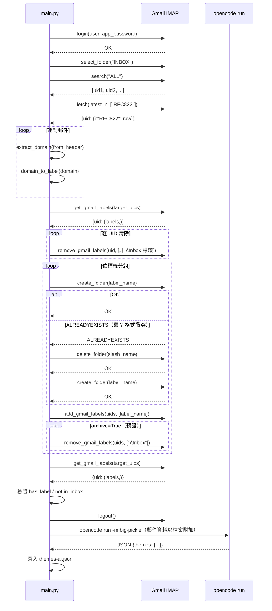
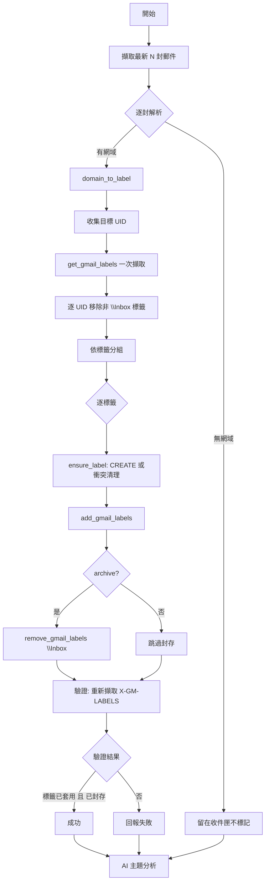
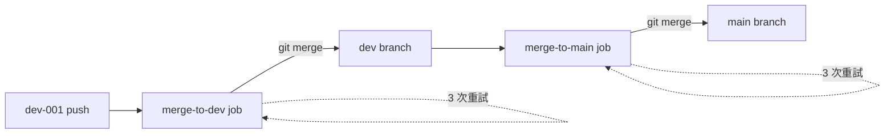

# Architecture（架構文件）

## 1. 系統概觀

本系統為單一 Python 腳本（`main.py`），執行 Gmail IMAP 郵件標記與 AI
主題分析。無持久層、無伺服器，為一次性命令列工具。

## 2. 元件

| 元件 | 說明 |
|------|------|
| `connect_imap()` | 以 IMAP + 應用程式密碼連線 Gmail |
| `fetch_latest_emails()` | 擷取最新 N 封收件匣郵件（RFC822） |
| `extract_domain()` / `domain_to_label()` | 網域擷取與扁平標籤轉換 |
| `ensure_label()` | 以 IMAP `CREATE` 建立標籤；`ALREADYEXISTS`時刪除舊 `/` 格式標籤後重試 |
| `label_emails()` | 核心流程：清除 -> 標記 -> 封存 -> 驗證 |
| `build_ai_input()` | 建構 AI 輸入資料 |
| `thematic_analysis()` | 呼叫 `opencode run` 進行主題分析 |

## 3. IMAP 互動時序

## 4. 標記工作流程

## 5. CI/CD 流程

