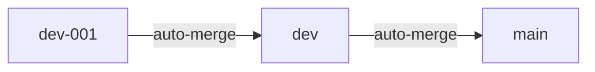

# Deployment Guide（部署指南）

## 1. 本地部署

### 1.1 系統需求

- Python 3.9+
- 已安裝 `opencode` CLI
- Gmail 帳號（已啟用兩步驟驗證）

### 1.2 安裝步驟

```bash
# 複製專案
git clone <repo-url>
cd gmail-nested-labels

# 建立虛擬環境
python3 -m venv venv
source venv/bin/activate
pip install -r requirements.txt

# 設定環境變數
cp .env.example .env
# 編輯 .env 填入 GMAIL_USER 和 GMAIL_APP_PASSWORD
```

### 1.3 執行

```bash
source venv/bin/activate
python main.py
```

## 2. CI/CD 部署

### 2.1 分支模型



### 2.2 開發變更週期

```bash
./commit.sh
```

1. 提示輸入語意化版本（`X.X.X`）。
2. 提示輸入 Changelog 摘要。
3. 暫存所有變更。
4. 提示輸入提交主旨與內文。
5. 以 `[{X.X.X}] {message}` 格式提交。
6. 推送到 `dev-001`。
7. CI 自動合併 `dev-001` -> `dev` -> `main`。

### 2.3 CI 工作流程

- 觸發：推送到 `dev-001`。
- `merge-to-dev` job：合併 `dev-001` 到 `dev`（3 次重試）。
- `merge-to-main` job：合併 `dev` 到 `main`（3 次重試）。
- 並發控制：`cancel-in-progress: true`。

## 3. 安全檢查清單

- [ ] `.env` 已被 `.gitignore` 排除
- [ ] `credentials.json` / `token.json` 已被 `.gitignore` 排除
- [ ] `venv/` 已被 `.gitignore` 排除
- [ ] `themes-ai.json` 已被 `.gitignore` 排除
- [ ] 應用程式密碼未寫入任何已提交檔案
