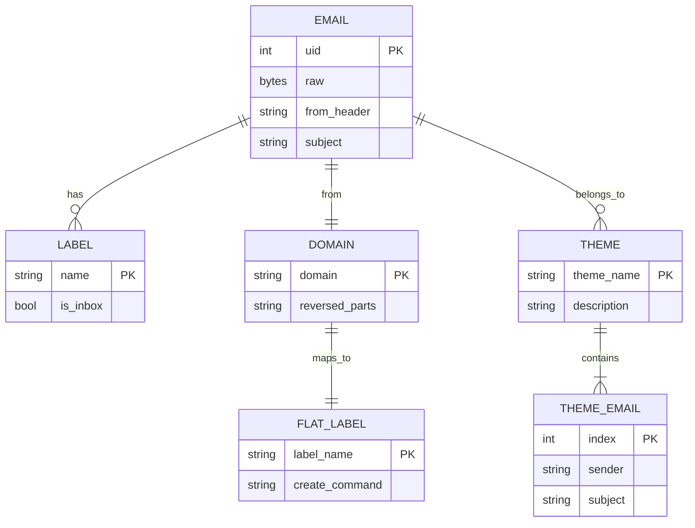

# ER（實體關係圖）

## 資料實體關係

## 實體說明

| 實體 | 說明 |
|------|------|
| `EMAIL` | 擷取的郵件，含 UID 與原始內容 |
| `LABEL` | Gmail 標籤（含系統標籤 `\Inbox`） |
| `DOMAIN` | 寄件者網域，切分後反轉 |
| `FLAT_LABEL` | 扁平標籤，由 `DOMAIN` 映射而來 |
| `THEME` | AI 主題分析的主題分組 |
| `THEME_EMAIL` | 歸屬某主題的郵件摘要 |
