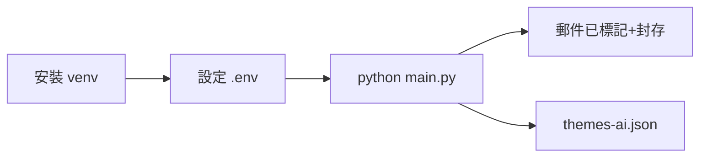

# Quick Start（快速入門）

## 1. 建立虛擬環境

```bash
python3 -m venv venv
source venv/bin/activate
pip install -r requirements.txt
```

## 2. 設定 Gmail 應用程式密碼

1. 前往 https://myaccount.google.com/security 啟用**兩步驟驗證**。
2. 前往 https://myaccount.google.com/apppasswords 產生**應用程式密碼**。
3. 複製 16 字元密碼。

## 3. 設定環境變數

```bash
cp .env.example .env
```

編輯 `.env`：

```
GMAIL_USER=you@gmail.com
GMAIL_APP_PASSWORD=xxxx-xxxx-xxxx-xxxx
```

## 4. 執行

```bash
# 預設：處理最新 10 封，標記後封存
python main.py

# 處理最新 25 封
python main.py -n 25

# 除錯模式：標記但不封存
python main.py --no-archive
```

## 5. 檢查結果

- Gmail 標籤：檢查是否出現如 `hk-gov-hko` 的扁平標籤。
- `themes-ai.json`：AI 主題分析結果。

## 6. 快速流程圖


