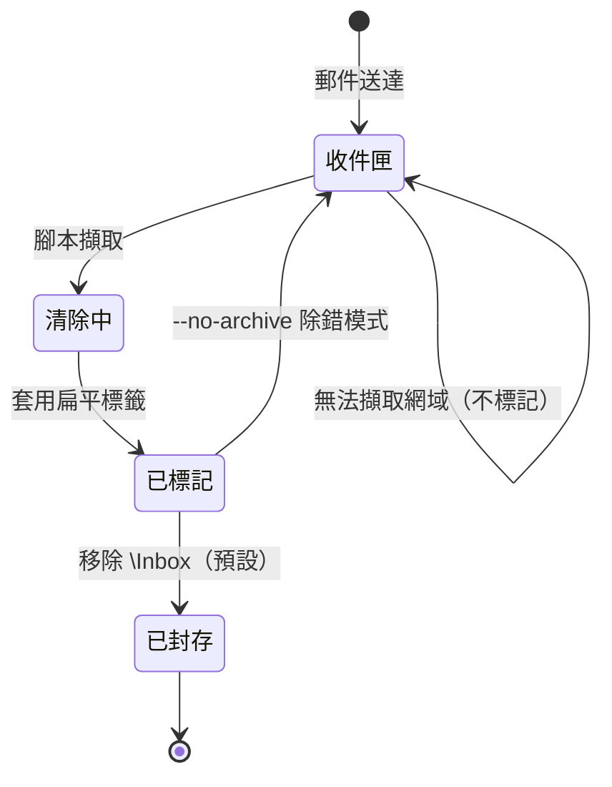
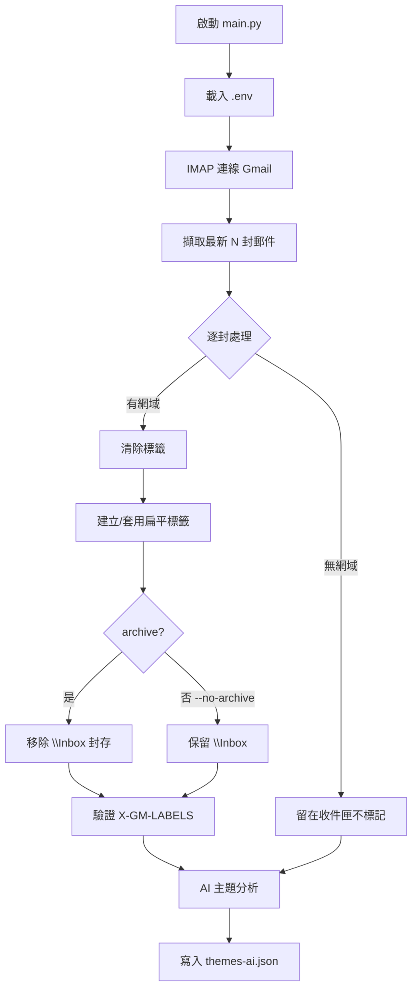

# SRS（軟體需求規格）

## 1. 簡介

### 1.1 目的
本文檔定義 Gmail 自動化專案的軟體需求，涵蓋功能、非功能需求與介面規格。

### 1.2 範圍
本軟體為命令列工具（`main.py`），執行 IMAP 郵件標記與 AI 主題分析。

## 2. 系統需求

### 2.1 功能需求

| 編號 | 需求 | 優先 |
|------|------|------|
| SR-1 | 以 IMAP + 應用程式密碼連線 Gmail | 高 |
| SR-2 | 擷取最新 N 封收件匣郵件（RFC822） | 高 |
| SR-3 | 清除 `\Inbox` 以外所有標籤 | 高 |
| SR-4 | 依反轉網域建立扁平標籤（`-` 接合） | 高 |
| SR-5 | 以 `CREATE` + `X-GM-LABELS` 套用標籤 | 高 |
| SR-6 | 移除 `\Inbox` 封存（可 `--no-archive` 停用） | 高 |
| SR-7 | 重新擷取 `X-GM-LABELS` 驗證結果 | 高 |
| SR-8 | AI 主題分析寫入 `themes-ai.json` | 中 |
| SR-9 | 無法擷取網域的郵件留在收件匣不標記 | 高 |

### 2.2 非功能需求

| 編號 | 需求 |
|------|------|
| SN-1 | Python 3.9+ |
| SN-2 | `venv` 環境隔離 |
| SN-3 | 批次處理減少 IMAP 往返 |
| SN-4 | 繁體中文本地化 |

## 3. 介面需求

### 3.1 CLI 介面

```
python main.py [-n COUNT] [--model MODEL] [--no-archive]
```

### 3.2 環境變數

| 變數 | 說明 |
|------|------|
| `GMAIL_USER` | Gmail 帳號 |
| `GMAIL_APP_PASSWORD` | 應用程式密碼 |
| `EMAIL_COUNT` | 預設擷取郵件數 |
| `OPENCODE_MODEL` | AI 模型名稱 |

## 4. 郵件狀態轉移



## 5. 資料流


